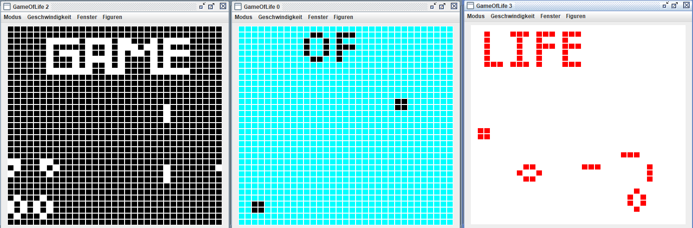

# Conway's Game of Life

Welcome to Conway's Game of Life! This is a Java implementation of the famous cellular automaton devised by the mathematician John Horton Conway.

## What is Conway's Game of Life?

Conway's Game of Life is a fascinating simulation that mimics the behavior of evolving cells in a grid. The game follows simple rules, yet produces complex patterns and behaviors. Each cell in the grid can either be alive or dead, and its status evolves over generations based on the following rules:

1. Any live cell with fewer than two live neighbors dies, as if by underpopulation.
2. Any live cell with two or three live neighbors lives on to the next generation.
3. Any live cell with more than three live neighbors dies, as if by overpopulation.
4. Any dead cell with exactly three live neighbors becomes a live cell, as if by reproduction.

By applying these rules repeatedly, you can observe mesmerizing patterns and even create self-replicating structures!

## Getting Started

To run the Game of Life, follow these steps:

1. Ensure you have the latest JDK (Java Development Kit) installed on your machine.
2. Download the [GameOfLife.jar](GameOfLife.jar) file from this repository.
3. Open a terminal or command prompt and navigate to the directory where you saved the JAR file.
4. Run the following command: `java -jar GameOfLife.jar`

## License

This project is licensed under the [MIT License](LICENSE). You are free to use,

